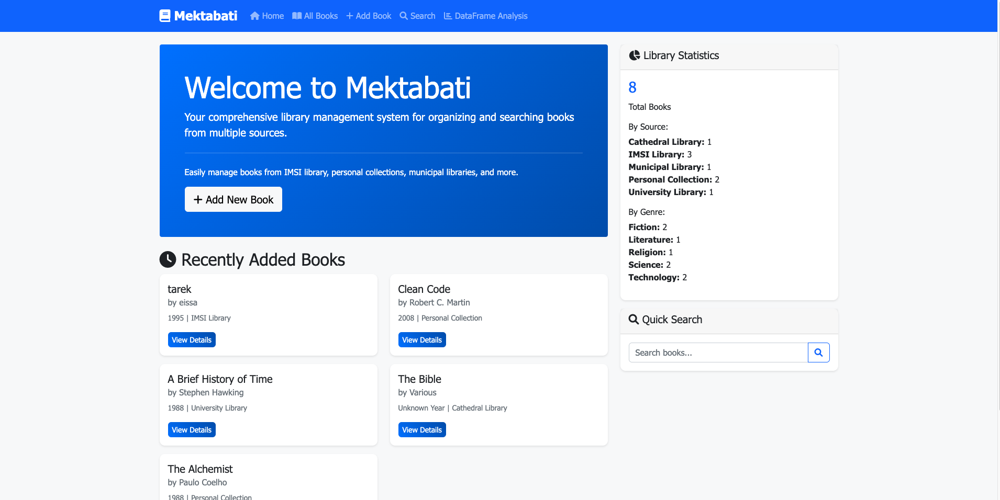
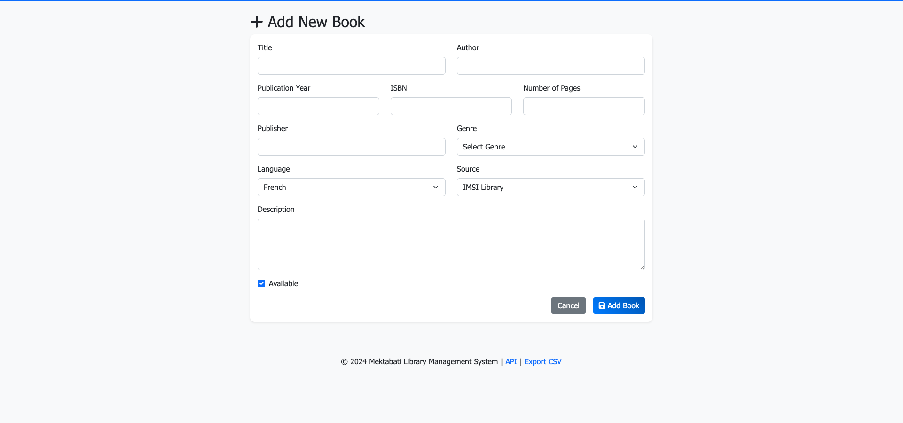
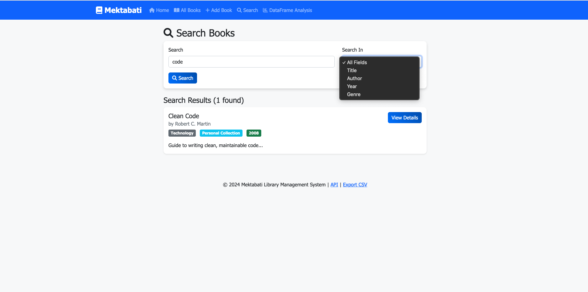
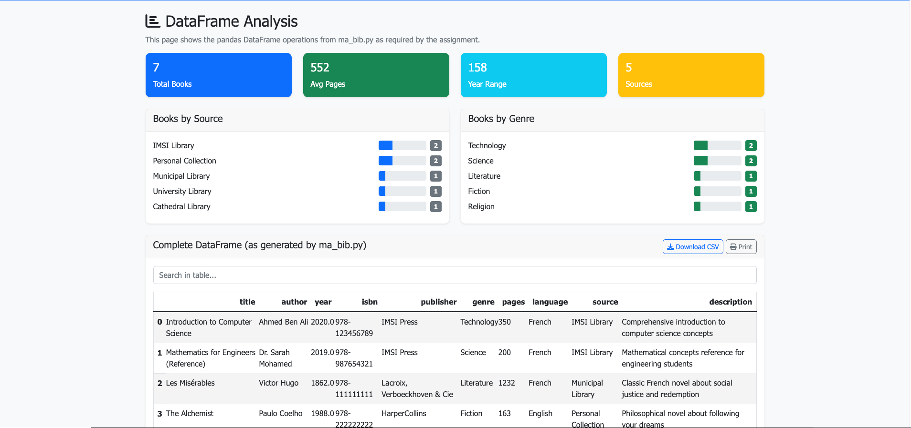

# 📚 Mektabati - Library Management System

[](https://opensource.org/licenses/MIT)
[](https://www.python.org/downloads/)
[](https://flask.palletsprojects.com/)
[](http://makeapullrequest.com)

A comprehensive Flask-based web application for managing books from multiple sources including IMSI library, personal collections, municipal libraries, and more.

<div align="center">
  
  <p><em>A comprehensive Flask-based web application for managing books from multiple sources</em></p>
</div>

## 📸 Screenshots

### 🏠 Dashboard
<div align="center">
  
  <p><em>Clean, responsive dashboard with library statistics and recent books</em></p>
</div>

### 📖 Book Management
<div align="center">
  
  <p><em>Intuitive form for adding books from multiple sources</em></p>
</div>

### 🔍 Advanced Search
<div align="center">
  
  <p><em>Powerful search functionality across multiple fields</em></p>
</div>

### 📊 Data Analysis
<div align="center">
  
  <p><em>Pandas DataFrame integration with statistical insights</em></p>
</div>


## 🌟 Features

- **📖 Book Management**: Add, view, edit, and organize books from multiple sources
- **🔍 Advanced Search**: Search by title, author, year, genre, or across all fields
- **📊 Data Analytics**: Complete pandas DataFrame integration with statistical analysis
- **🌐 Web Interface**: Responsive Bootstrap design with mobile support
- **🔄 REST API**: JSON endpoints for programmatic access
- **📤 Data Export**: CSV and JSON export functionality
- **📈 Dashboard**: Interactive statistics and recent books overview

## 🚀 Quick Start

### Prerequisites

- Python 3.8 or higher
- pip (Python package installer)

### Installation

1. **Clone the repository**
   ```bash
   git clone https://github.com/yourusername/mektabati.git
   cd mektabati
   ```

2. **Create virtual environment**
   ```bash
   python -m venv venv
   source venv/bin/activate  # On Windows: venv\\Scripts\\activate
   ```

3. **Install dependencies**
   ```bash
   pip install -r requirements.txt
   ```

4. **Run the application**
   ```bash
   python app.py
   ```

5. **Open your browser**
   Navigate to `http://localhost:5000`

## 📁 Project Structure

```
mektabati/
├── 📄 app.py                 # Main Flask application
├── ⚙️ config.py             # Configuration settings
├── 📋 requirements.txt      # Python dependencies
├── 📚 ma_bib.py            # Core library data processing
├── 📁 models/
│   ├── __init__.py
│   └── book.py             # Database models
├── 📁 forms/
│   ├── __init__.py
│   └── book_forms.py       # Web forms with validation
├── 📁 templates/           # HTML templates
│   ├── base.html
│   ├── index.html
│   ├── add_book.html
│   ├── search.html
│   ├── book_detail.html
│   ├── books.html
│   └── dataframe.html
├── 📁 static/             # Static assets
│   ├── css/style.css
│   └── js/main.js
├── 📁 tests/              # Unit tests
└── 📁 instance/           # Instance-specific files
```

## 💡 Usage

### Adding Books
1. Click **"Add Book"** in the navigation
2. Fill in book details (title and author required)
3. Select source (IMSI Library, Personal Collection, etc.)
4. Submit the form

### Searching Books
- **Quick Search**: Use the search bar on homepage
- **Advanced Search**: Visit the Search page for field-specific searches
- **API Search**: Use `/api/search?q=query&field=title`

### Data Analysis
- Visit **DataFrame Analysis** page for pandas operations
- View library statistics and data insights
- Export data as CSV or JSON

## 🔌 API Endpoints

| Endpoint | Method | Description |
|----------|--------|-------------|
| `/api/books` | GET | Retrieve all books as JSON |
| `/api/search` | GET | Search books (`?q=query&field=title`) |
| `/export/csv` | GET | Export library data as CSV |

### Example API Usage

```bash
# Get all books
curl http://localhost:5000/api/books

# Search for books
curl "http://localhost:5000/api/search?q=python&field=title"
```

## 🏗️ Architecture

### Backend
- **Flask**: Web framework with application factory pattern
- **SQLAlchemy**: ORM for database operations
- **WTForms**: Form handling and validation
- **Pandas**: Data processing and analysis

### Frontend
- **Bootstrap 5**: Responsive UI framework
- **JavaScript**: Interactive functionality
- **Font Awesome**: Icons and visual elements

### Database
- **SQLite**: Lightweight embedded database
- **Automatic migrations**: Database schema managed by SQLAlchemy

## 🧪 Testing

Run the test suite:

```bash
# Run all tests
python -m pytest tests/ -v

# Run specific test file
python -m pytest tests/test_app.py -v

# Run with coverage
pip install pytest-cov
python -m pytest tests/ --cov=. --cov-report=html
```

## 📊 Assignment Compliance

This project fulfills all academic requirements:

- ✅ **1.5 Books from IMSI Library**: Sample data included
- ✅ **5 Personal Choice Books**: From various sources
- ✅ **DataFrame with Search**: Complete `ma_bib.py` implementation
- ✅ **Search by Multiple Fields**: Title, author, year, genre
- ✅ **Graphical Interface**: Professional web application
- ✅ **Online Version**: Full Flask web application

## 🔧 Configuration

### Environment Variables

Create a `.env` file for custom configuration:

```bash
FLASK_CONFIG=development
SECRET_KEY=your-secret-key-here
DATABASE_URL=sqlite:///mektabati.db
```

### Development vs Production

```bash
# Development mode
export FLASK_CONFIG=development
python app.py

# Production mode (with gunicorn)
export FLASK_CONFIG=production
pip install gunicorn
gunicorn app:app
```

## 🤝 Contributing

We welcome contributions! Please see [CONTRIBUTING.md](CONTRIBUTING.md) for guidelines.

1. Fork the repository
2. Create a feature branch (`git checkout -b feature/amazing-feature`)
3. Commit your changes (`git commit -m 'Add amazing feature'`)
4. Push to the branch (`git push origin feature/amazing-feature`)
5. Open a Pull Request

## 📝 License

This project is licensed under the MIT License - see the [LICENSE](LICENSE) file for details.

## 🙏 Acknowledgments

- Built for educational purposes as part of library management coursework
- Uses open-source libraries and frameworks
- Inspired by modern web application best practices

## 📞 Support

- 🐛 **Bug Reports**: [Create an issue](https://github.com/yourusername/mektabati/issues)
- 💡 **Feature Requests**: [Create an issue](https://github.com/yourusername/mektabati/issues)
- 📧 **Questions**: [Start a discussion](https://github.com/yourusername/mektabati/discussions)

## 🔗 Links

- [Flask Documentation](https://flask.palletsprojects.com/)
- [SQLAlchemy Documentation](https://docs.sqlalchemy.org/)
- [Bootstrap Documentation](https://getbootstrap.com/)
- [Pandas Documentation](https://pandas.pydata.org/)

---

**Made with ❤️ for education and learning**
"""

print("✅ Complete Mektabati Flask Project Prepared for GitHub!")
print("\n📁 Complete Project Structure:")
print("""
mektabati/
├── 📄 .gitignore                # Git ignore file
├── 📄 LICENSE                   # MIT License
├── 📄 README.md                 # Updated GitHub README
├── 📄 CONTRIBUTING.md           # Contribution guidelines
├── 📄 requirements.txt          # Python dependencies
├── 📄 setup.py                  # Package setup
├── 📄 app.py                    # Main Flask application
├── ⚙️ config.py                # Configuration settings
├── 📚 ma_bib.py                # Core library data processing
├── 🔧 .env.example             # Environment variables template
├── 📁 models/
│   ├── __init__.py             # Package initialization
│   └── book.py                 # Database models
├── 📁 forms/
│   ├── __init__.py             # Package initialization
│   └── book_forms.py           # Web forms with validation
├── 📁 templates/               # HTML templates
│   ├── base.html
│   ├── index.html
│   ├── add_book.html
│   ├── search.html
│   ├── book_detail.html
│   ├── books.html
│   └── dataframe.html
├── 📁 static/                  # Static assets
│   ├── css/
│   │   └── style.css
│   └── js/
│       └── main.js
├── 📁 tests/                   # Unit tests
│   ├── __init__.py
│   └── test_app.py
├── 📁 instance/                # Instance files
│   └── .gitkeep
├── 📁 .github/                 # GitHub Actions
│   └── workflows/
│       └── ci.yml
└── 📁 docs/                    # Documentation (optional)
""")